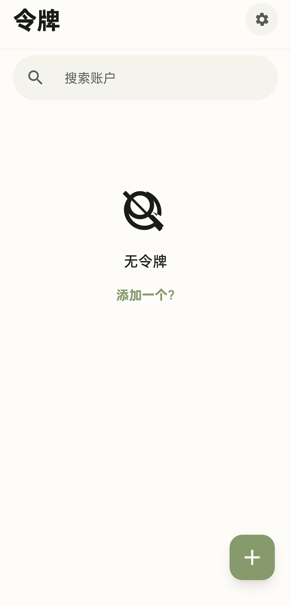
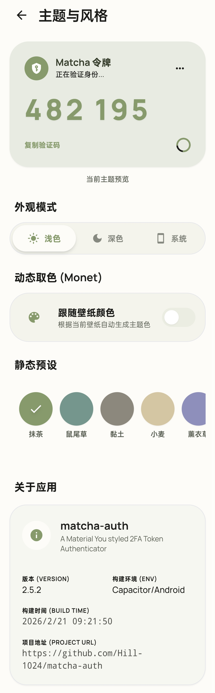

# 我为什么做这个应用
有一天我在谷歌令牌验证器上不小心按了一下导出,其交互默认展示二维码后清空令牌,我永久的失去了我的某些平台的访问能力,不满于这神秘的交互逻辑与封闭性(令牌导入谷歌验证器之后就只能在谷歌验证器之间转移),于是**Matcha-Auth**诞生了

# 应用特点
- UI风格选择为Material Design,这很Google
- 使用React+Capacitor构建,开发简单迅速
- 引入了莫奈取色(为此还写了一个[Capacitor插件](https://github.com/hill-1024/Monet-Color-For-Capacitor) ),在Android12+设备上与系统主题配色风格统一化

# 预览

